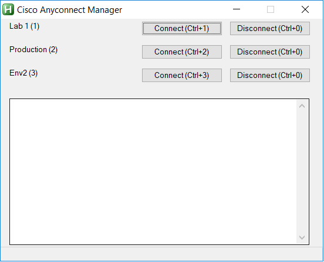

# ciscoAnyconnectControll
An AHK script to automate connecting to multiple VPN Profiles via Cisco Anyconnect.
It also can automatically copy the security token from Symantec VIP and also click accept on the banner displayed by Cisco Anyconnect.

Basically to replace [anyconnectVPNswitcher](https://github.com/kulldox/anyconnectVPNswitcher) based on batch scripts.

Install:
1) Have [AHK](https://www.autohotkey.com/) installed on you windows box
2) Copy the ```anyconnectControll.ahk``` to ```C:\Users\Username\AppData\Roaming\Microsoft\Windows\Start Menu\Programs\Startup```
3) Copy ```anyconnectControll-Sample.ini``` into ```C:\Users\Username\AppData\Roaming\Microsoft\Windows\Start Menu\Programs\Startup\anyconnectControll.ini``` and update it with your profiles
4) Start the ```anyconnectControll.ahk``` and enjoy



Warning:
This script expects you to have your user/pass in clear stored in the ini file. That might be a security concern.
